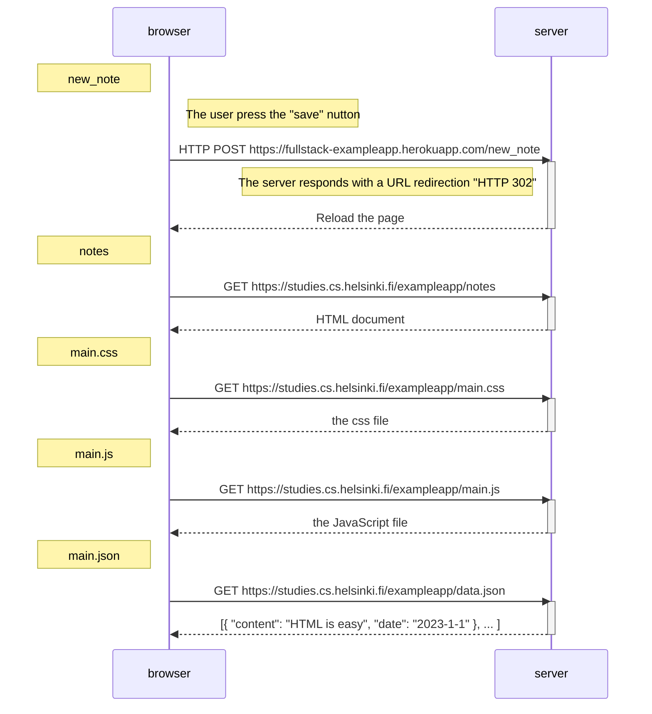

```mermaid
sequenceDiagram
    participant browser
    participant server

    Note left of browser: new_note
    Note right of browser: The user press the "save" nutton
    browser->>server: HTTP POST https://fullstack-exampleapp.herokuapp.com/new_note
    activate server
    Note left of server: The server responds with a URL redirection "HTTP 302"
    server-->>browser: Reload the page
    deactivate server

    Note left of browser: notes
    browser->>server: GET https://studies.cs.helsinki.fi/exampleapp/notes
    activate server    
    server-->>browser: HTML document
    deactivate server

    Note left of browser: main.css
    browser->>server: GET https://studies.cs.helsinki.fi/exampleapp/main.css
    activate server
    server-->>browser: the css file
    deactivate server

    Note left of browser: main.js
    browser->>server: GET https://studies.cs.helsinki.fi/exampleapp/main.js
    activate server
    server-->>browser: the JavaScript file
    deactivate server

    Note left of browser: main.json
    browser->>server: GET https://studies.cs.helsinki.fi/exampleapp/data.json
    activate server
    server-->>browser: [{ "content": "HTML is easy", "date": "2023-1-1" }, ... ]
    deactivate server

```
